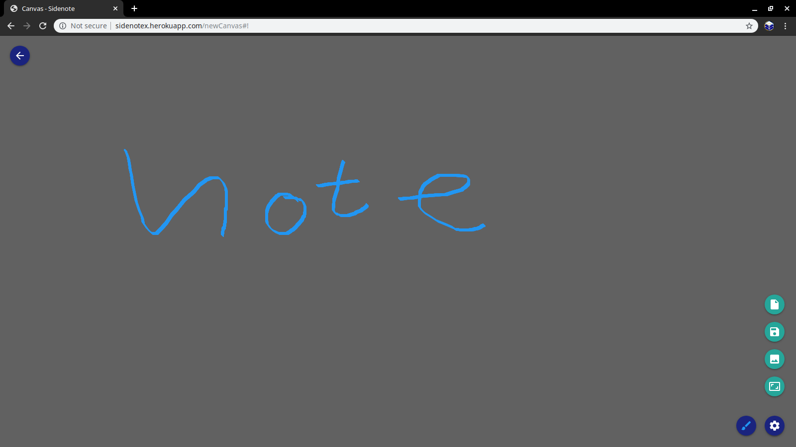

Tutorial
========

*Login Page*

.. image:: images/loginPage.png

Existing users can input information here to sign in to view their notes and new users can enter in their information under the Sign In tab.

*Clean User Page* (Dark Theme setting on)

.. image:: images/newUserPage.png

After registering new users will be taken to this page. There are buttons near the top which list their purpose when hovered over.
They include: Settings, New Canvas, New To-Do List and New Note.

*Making New Canvas Page*

This is what will display when user types New Canvas button on User Page.
The user can write freehand on the page, upload a picture, reset the page or make the screen fullpage.
One of the features is Save which will keep the canvas and display it on User page. Once Save is clicked user will be prompt with naming and giving a hash to the item. 

*Updated User Page*

.. image:: images/afterSavingNewNote.png

This canvas was named "First note" and given the hashtag First. Now that I have a Canvas created I can share it with other people or edit it later.
